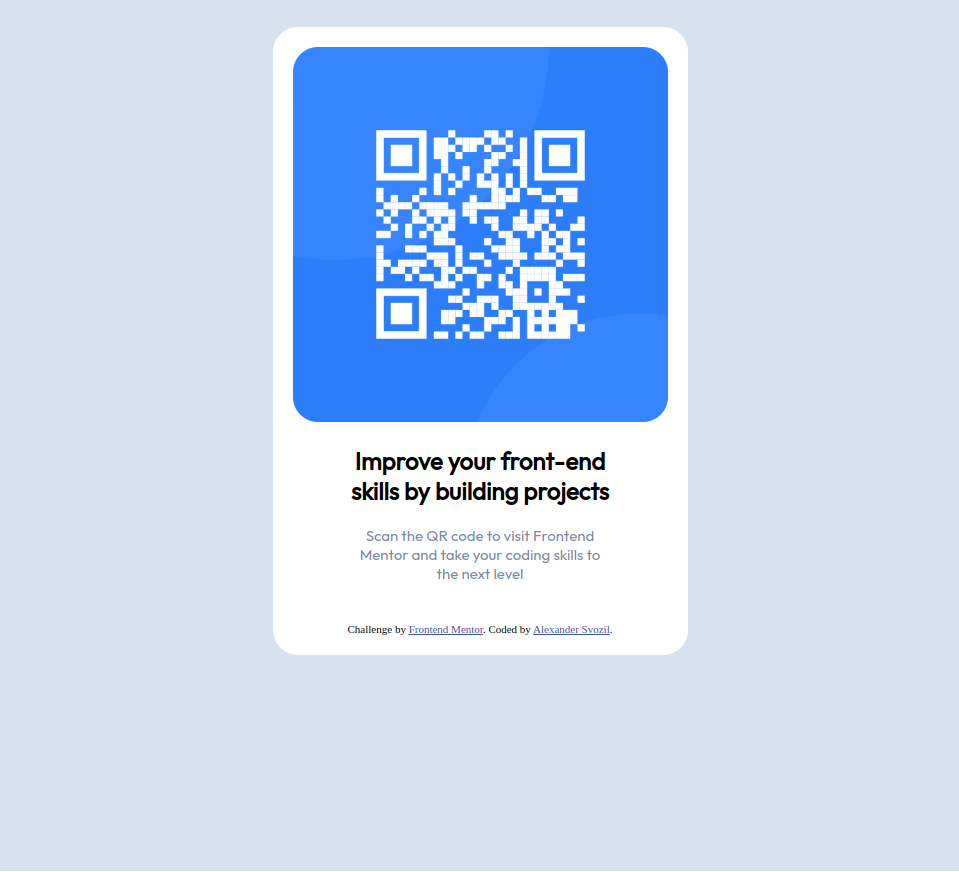

# Frontend Mentor - QR code component solution

This is a solution to the [QR code component challenge on Frontend Mentor](https://www.frontendmentor.io/challenges/qr-code-component-iux_sIO_H). Frontend Mentor challenges help you improve your coding skills by building realistic projects.

## Table of contents

- [Frontend Mentor - QR code component solution](#frontend-mentor---qr-code-component-solution)
  - [Table of contents](#table-of-contents)
  - [Overview](#overview)
    - [Screenshot](#screenshot)
    - [Links](#links)
  - [My process](#my-process)
    - [Built with](#built-with)

**Note: Delete this note and update the table of contents based on what sections you keep.**

## Overview

### Screenshot

### Links

- Live Site URL: [Add live site URL here](https://alexandersvozil.github.io/frontendmentor/challenge_1/index.html)

## My process

``Front-end engineering is for people that are too lazy for Math'' - Alexander Svozil (2011). Trying to learn webdesign fast after rejecting CSS completely during my university studies since it is an important
skill for building a business.

### Built with

- Semantic HTML5 markup
- CSS custom properties
- Flexbox
